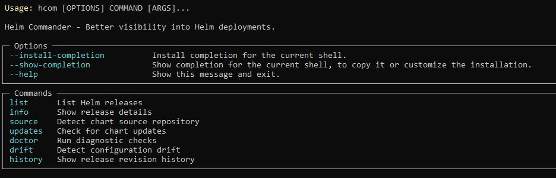
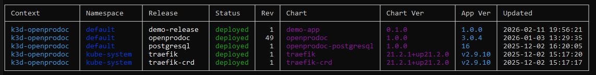
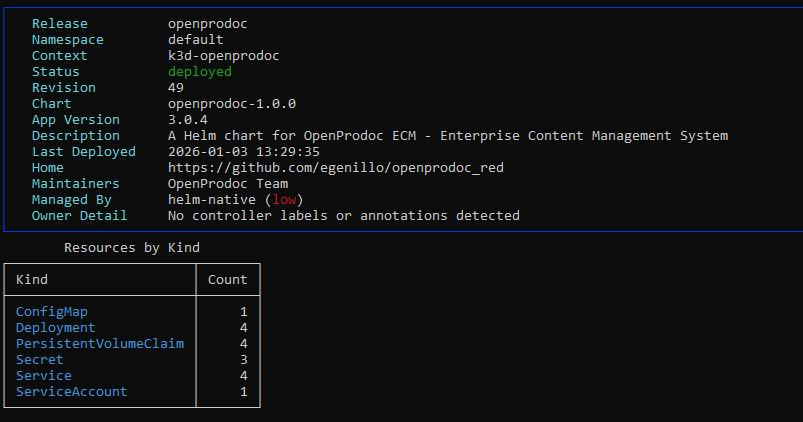
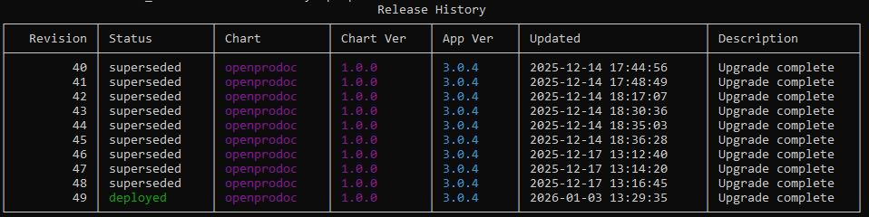
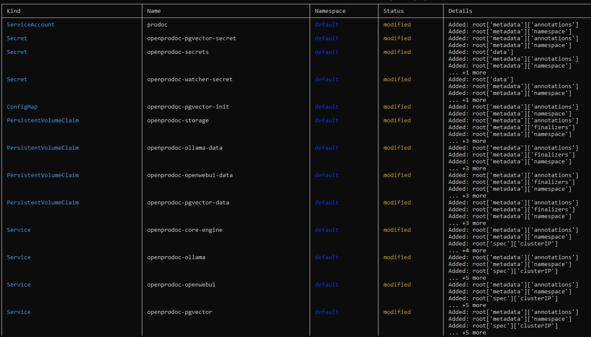
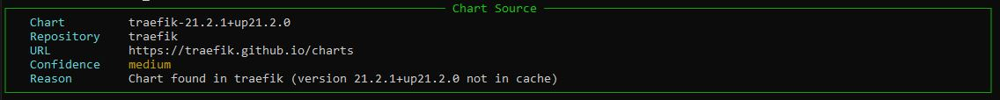
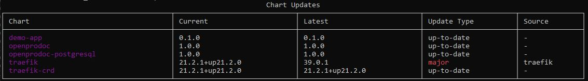
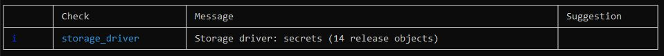

# Helm Commander

A Python CLI application that gives you better visibility into Helm deployments on Kubernetes clusters. It reads Helm release data **directly from the Kubernetes API** — no `helm` CLI binary required. Works on Windows and Linux.

## How It Works

### Helm Release Decoding

Helm v3 stores each release revision as a Kubernetes Secret of type `helm.sh/release.v1`. The release payload is compressed and encoded. Helm Commander reverses this:

**From Secrets** (most common):
```
secret.data["release"]    (bytes — K8s client auto-decodes the outer base64)
  → base64 decode          (Helm's own base64 layer)
  → gzip decompress        (Helm's compression)
  → UTF-8 decode           (get JSON string)
  → JSON parse             (get release dict)
  → HelmRelease dataclass  (structured Python object)
```

**From ConfigMaps** (legacy storage driver):
```
configmap.data["release"]  (string)
  → base64 decode          (first layer, stored as string)
  → base64 decode          (Helm's base64 layer)
  → gzip decompress
  → JSON parse
```

Each Secret carries labels (`name`, `status`, `version`, `owner=helm`) that allow quick filtering without decoding the full payload. Helm Commander uses this to efficiently list releases by decoding only the latest revision per release.

### Owner Detection

Helm Commander detects who manages each release by checking (in priority order):

1. **Argo CD** — `argocd.argoproj.io/instance` label or tracking annotations → HIGH confidence
2. **Flux CD** — `helm.toolkit.fluxcd.io/name` label or HelmRelease CRDs → HIGH confidence
3. **k3s HelmChart** — `helm.cattle.io/v1` CRDs in kube-system → HIGH confidence
4. **Resource annotations** — `app.kubernetes.io/managed-by` → MEDIUM confidence
5. **Fallback** — Native Helm, LOW confidence

### Drift Detection

The `drift` command compares the rendered manifests stored inside the Helm release against the live resources in the cluster. It uses `deepdiff` for structural comparison and automatically ignores server-managed fields (`resourceVersion`, `uid`, `managedFields`, `status`, etc.) to reduce noise.

## Prerequisites

- **Python 3.10+**
- **kubectl access** — a valid kubeconfig (`~/.kube/config` or `KUBECONFIG` env var) with permissions to list Secrets and ConfigMaps
- **RBAC** — the configured service account / user needs at minimum:
  - `get`/`list` on Secrets (type `helm.sh/release.v1`) in target namespaces
  - `get`/`list` on the resource kinds you want to drift-check (Deployments, Services, etc.)
  - `list` on CustomResourceDefinitions (optional, for Argo CD / Flux / k3s detection)

## Installation

### Option A: Install from source (recommended for daily use)

```bash
# Clone the repository
git clone <repo-url> helm_commander
cd helm_commander

# Install in editable mode (creates the `hcom` and `helm-commander` commands)
pip install -e .

# Verify
hcom --help
```

After this, the `hcom` command is available globally in your terminal. Any edits you make to the source take effect immediately (editable install).

### Option B: Run without installing

You can run Helm Commander directly as a Python module without installing it, as long as dependencies are present:

```bash
cd helm_commander

# Install dependencies only
pip install typer[all] kubernetes rich pyyaml deepdiff packaging requests

# Run via python -m
python -m helm_commander --help

# Or set PYTHONPATH and run
# Linux/macOS:
PYTHONPATH=src python -m helm_commander list
# Windows (PowerShell):
$env:PYTHONPATH="src"; python -m helm_commander list
```

### Option C: Build a distributable wheel

```bash
cd helm_commander

# Install build tool
pip install build

# Build the wheel
python -m build

# The wheel file will be in dist/
# Install it anywhere:
pip install dist/helm_commander-0.1.0-py3-none-any.whl

# Now `hcom` and `helm-commander` commands are available
hcom --help
```

### Option D: Build a standalone executable with PyInstaller

```bash
cd helm_commander
pip install -e .
pip install pyinstaller

# Build a single-file executable
pyinstaller --onefile --name hcom --paths src src/helm_commander/__main__.py

# The executable will be in dist/hcom.exe (Windows) or dist/hcom (Linux)
./dist/hcom --help
```

## Usage

All commands use the `hcom` entry point (or `helm-commander`, they are aliases).



### List releases

```bash
# List all releases across all namespaces (default)
hcom list

# List releases in a specific namespace
hcom list -n production

# Output as JSON or YAML
hcom list --output json
hcom list --output yaml

# Filter by name or chart (regex)
hcom list --filter "nginx|traefik"

# Show only problematic releases (failed, pending, etc.)
hcom list --only problematic

# Use a specific kubeconfig context
hcom list --context my-cluster
```



### Release details

```bash
# Show release info (chart metadata, resource counts, owner detection)
hcom info my-release

# Include user-supplied values
hcom info my-release --show-values

# Scope to namespace
hcom info my-release -n production
```



### Revision history

```bash
# Show all revisions with chart versions, timestamps, and status
hcom history my-release
hcom history my-release --output json
```



### Drift detection

```bash
# Compare stored manifests vs live cluster state
hcom drift my-release

# JSON output for CI pipelines
hcom drift my-release --output json
```

Output shows each resource as `unchanged`, `modified`, `missing_live`, or `extra_live` with details about what changed.



### Chart source detection

```bash
# Detect which Helm repo a chart came from (uses local Helm cache)
hcom source my-release
```

This scans your local Helm repository cache (`~/.cache/helm/repository/` on Linux, `%APPDATA%\helm\repository\` on Windows) for matching index entries.



### Update checking

```bash
# Check all deployed charts for available updates
hcom updates

# JSON output
hcom updates --output json
```

Compares deployed chart versions against versions available in your locally cached Helm repo indexes. Run `helm repo update` first for accurate results.



### Diagnostics

```bash
# Run diagnostic checks
hcom doctor
```

Checks for:
- Storage driver detection (secrets vs configmaps, mixed mode)
- Failed releases
- Stuck pending operations
- Releases with only superseded revisions (no deployed version)
- Duplicate chart deployments in the same namespace
- Orphaned Helm secrets
- Releases with excessive stored revisions



## Output Formats

Every command supports `--output` (`-o`) with three formats:

| Format | Flag | Description |
|--------|------|-------------|
| Table | `--output table` | Rich formatted tables with colors (default) |
| JSON | `--output json` | Machine-readable JSON |
| YAML | `--output yaml` | YAML output |

## Project Structure

```
src/helm_commander/
├── cli/                  # Typer CLI commands
│   ├── app.py            # Root app, registers all sub-commands
│   ├── options.py        # Shared --output, --namespace, --context options
│   └── commands/         # One file per command (list, info, drift, etc.)
├── core/                 # Business logic
│   ├── k8s_client.py     # Kubernetes API wrapper
│   ├── helm_decoder.py   # Secret/ConfigMap → HelmRelease
│   ├── release_store.py  # List/get/filter releases
│   ├── drift_engine.py   # Stored vs live manifest comparison
│   ├── repo_resolver.py  # Chart source detection from local cache
│   ├── update_checker.py # Version comparison against available charts
│   ├── doctor_engine.py  # Diagnostic checks
│   └── owner_detector.py # Argo CD / Flux / k3s detection
├── models/               # Dataclasses (release, chart, diff, repo, doctor)
├── output/               # Rich table builders, formatters, color themes
├── config/settings.py    # Helm cache paths, storage driver defaults
└── utils/                # Encoding, manifest parsing, version comparison
```


## Configuration

Helm Commander reads your standard kubeconfig for cluster access. It also reads local Helm cache files for source detection and update checking:

| Path | Platform | Purpose |
|------|----------|---------|
| `~/.cache/helm/repository/` | Linux/macOS | Cached repo index files |
| `%APPDATA%\helm\repository\` | Windows | Cached repo index files |
| `~/.config/helm/repositories.yaml` | Linux/macOS | Known repo list |
| `%APPDATA%\helm\repositories.yaml` | Windows | Known repo list |

The storage driver defaults to `secrets` (Helm v3 default). If your cluster uses ConfigMaps, the doctor command will detect this automatically.

